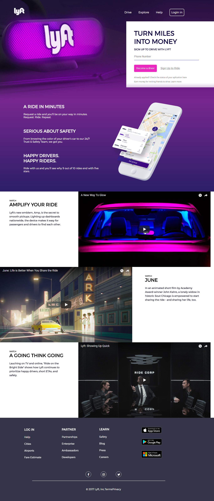

# Lyft

* **Unidad:** _Maquetado web con HTML & CSS_

***

Para completar este reto, hemos creado un repositorio Lyft que contiene todos los recursos que necesitamos.
Esto incluye imágenes, estructura de carpetas y archivos.

## Flujo de trabajo

1. Empezamos con la estructura del proyecto enlazando los archivos css,la página de font awesome donde obtendremos los iconos y para los tipos de letra con:
[Font Awesome](http://fontawesome.io/).
[Font google](https://fonts.google.com/?query=mon&selection.family=Montserrat)

2. Realizamos el maquetado del html en `index.html` ,donde colocaremos los diferentes **section** que contendra  nuestra pagina.
  `header`(`nav`,`first`)
  `second`
  `videos`
  `footer`

3.  En el `nav` dentro del aplicamos las clases:
 - `nav-lyft`, `logo`, `li-right`, `botton`.

4. En la section `first` Utilizaremos:
 - `first-box` ,`text-uppercase` ,`input` y `button`.

5. En la section `second` utilizamos el div `box-lefth` y la etiqueta `img`.

6. En la section `videos` utilizaremos las etiquetas `iframe`.
- Estos son los videos a utilizar:
  * https://www.youtube.com/watch?v=fLSmUWOYpKw
  * https://www.youtube.com/watch?v=v8nyGzOLsdw&t=1s
  * https://www.youtube.com/watch?v=xj2VWLV0xCU

7. En la section `footer` utilizamos los iconos de **font awesome** y daremos un hover a las listas para que se muestre asi:

   

7. luego añadimos los estilos al `main.css`,con los diferentes selectores de las clases, ID's.

8. Utilizamos la tipografía `Montserrat`.

## Objetivo

Este es el resultado que podrás visualizar:

**Realizado por :**

* Marina Rodriguez
* Jessica Manturano
